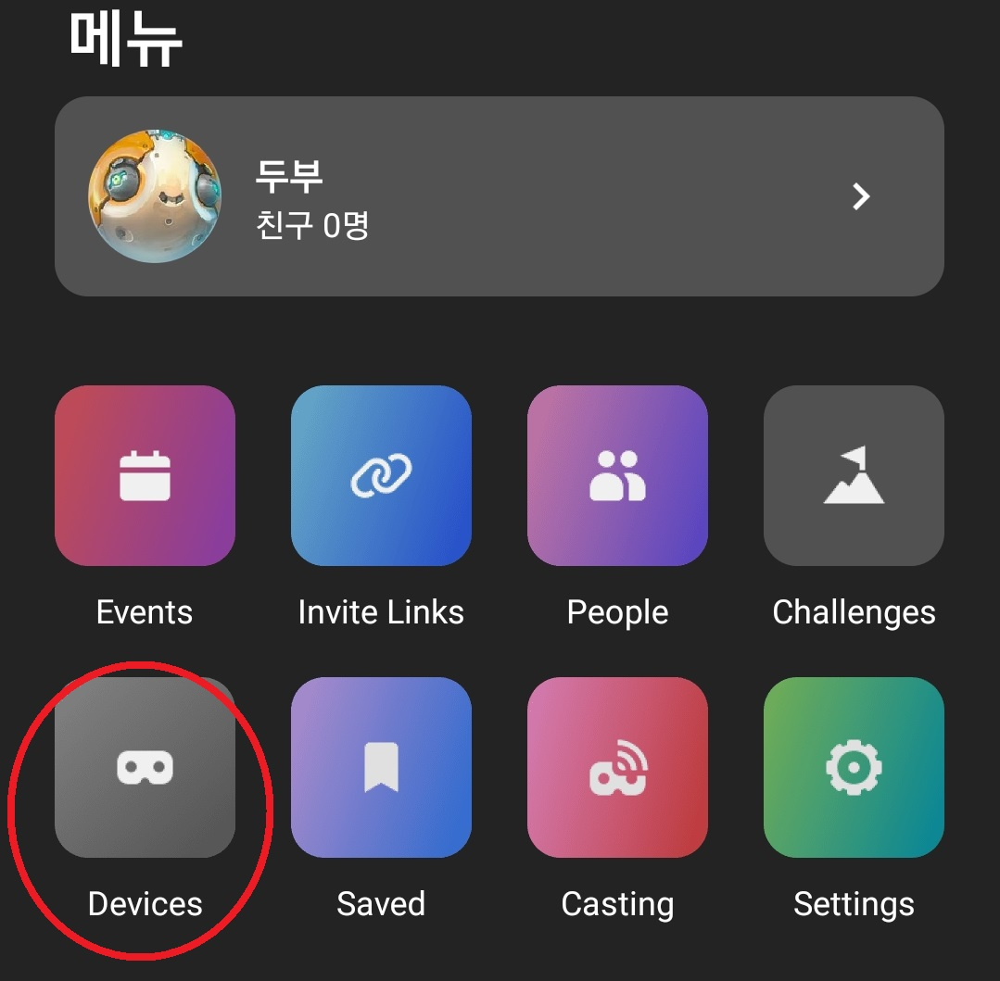
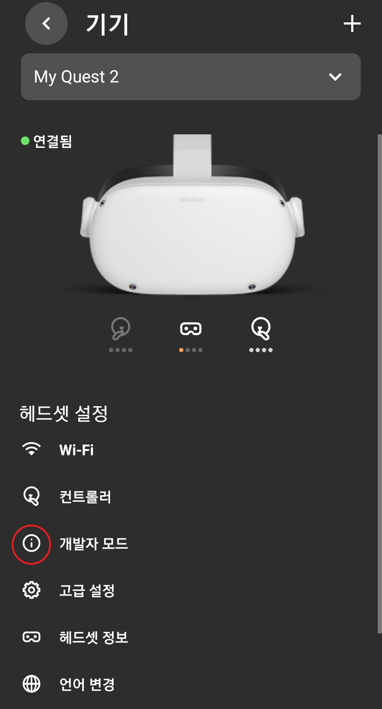

<h2>오큘러스 개발자모드 셋팅</h2>

- 페이스북 계정 생성
- 핸드폰 보유, 오큘러스 앱 설치
- 개발자 등록

<h3>개발자 계정 설정</h3>
개발을 시작하려면 휴대폰의 Oculus앱에서 장치에 대한 개발자 모드를 활성해줘야 합니다. 기기를 개발자 모드로 전환하려면 먼저 Oculus 대시보드에서 개발자 조직에 속해있는 상태여야 합니다. 
 

- Oculus 대시보드: https://developer.oculus.com/manage/ 
- 조직 생성: https://developer.oculus.com/manage/organizations/create/ 
- 계정 확인: https://developer.oculus.com/manage/verify/ 
 

1. 해드셋에서 개발자 계정에 등록한 계정으로 로그인한다
1. 오큘러스 모바일 앱에서 Devices로 이동한다
1. 해드셋을 선택하고 '개발자 모드' 메뉴로 이동한다
1. 개발자 모드를 활성화한다.
1. USB-C 케이블을 사용하여 헤드셋을 컴퓨터에 연결하고 착용한다
1. USB 디버깅 허용 및 헤드셋에 메시지가 표시되면 허용을 수락한다.

 
드라이버 설치: https://developer.oculus.com/downloads/package/oculus-adb-drivers/ 

알 수 없는 출처 허용

<h3>유니티 설정</h3>

~~Oculus Integration: https://assetstore.unity.com/packages/tools/integration/oculus-integration-82022 ~~
(불안정한 Oculus Integration를 사용하지 않고 진행할 예정입니다.)

XR Setting - Oculus  
Package Manager - Setting - show preview package 
XR Interaction Toolkit 
XR Management 
Project Settings - XR Plugin Management - Oculus XR Plugin 
Android -> Plugin Providers에서 Oculus Loader 추가 
기존 카메라 삭제 후 Creat -> XR -> Room-Scale XR Rig 추가 
실행
  

<h4>reference</h4>
https://developer.oculus.com/documentation/native/android/mobile-device-setup/ 
https://www.youtube.com/watch?v=zWI7zX-Hg6c&t