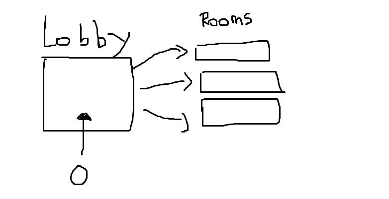

## 1-2차시 수업내용: Photon Network

### Photon Network
 
Photon Unity Networking (PUN)은 멀티플레이어 게임용 유니티 패키지입니다. 유연한 매치메이킹을 통해 플레이어들은 객체들이 네트워크를 통해 동기화될 수 있는 룸으로 이끌어 줍니다. 유저들이 매치되어 게임을 플레이 할 수 있는 룸과, 이 룸의 대한 정보를 얻을 수 있는 로비로 구성됩니다.

[Photon DOC](https://doc.photonengine.com/ko-kr/pun/current/getting-started/pun-intro)

### ParrelSync
ParrelSync는 사용자가 다른 Unity 편집기 창을 열어 원래 프로젝트의 변경 사항을 미러링하여 프로젝트를 빌드하지 않고도 멀티플레이어 게임 플레이를 테스트할 수 있는 Unity editor extension입니다.

[ParrelSync Github](https://github.com/VeriorPies/ParrelSync)

### Scroll View
지정된 영역 안에 Content를 Scroll하여 볼 수 있는 UI입니다. Layout Group이나 Content Size Fillter와 같은 컴포넌트와 같이 사용됩니다.

[ScrollView](https://blog.naver.com/eastfever5/222095602409)
